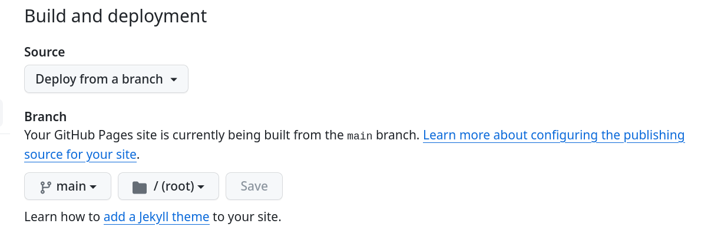

# Forestry Wellness Checkup App

- [Description](#org2d97f03)
- [Deploying](#orgea3b804)
  - [Web (Separate Repo With GitHub Pages)](#orge884844)
    - [Step By Step](#org5d2c073)
    - [One-Liner](#org14f599a)
  - [Android (apk file)](#org8ee66c3)
- [Documentation](#org8322473)


<a id="org2d97f03"></a>

# Description

Owning forested land comes with many responsibilities. With the ever growing issue of climate change and natural health threats one may easily get overwhelmed. Fortunately for landowners there are forestry and conservation professionals that can aid with this process. The professionals survey the forested lands in question and advise the landowners of any health issues they have diagnosed. They can suggest a course of action which the landowners are free to take or reject.

Our team will build the Forest Wellness Checkup Application (FWCA) for The Oregon State University (OSU) Extension Service in order to help the above professionals during their surveys. Under the guidance of OSU Extension Professors Fitzgerald, Punches, and Ahrens we will develop a checklist that the professionals can use on their tablets when inspecting the forests.


<a id="orgea3b804"></a>

# Deploying


<a id="orge884844"></a>

## Web (Separate Repo With GitHub Pages)


<a id="org5d2c073"></a>

### Step By Step

1.  Build the web app

    ```shell
     flutter build web
    ```

2.  Copy output files to root directory of other repo to be used for GitHub Pages

    ```shell
     cp -r build/web/* /path/to/github-pages/repo/root
    ```

    -   NOTE: Use the root directory because GitHub pages expects the static site to be hosted in either the
        1.  root directory
        2.  the top level `docs/` directory

3.  Edit base for all routes in output file `build/web/index.html`. In particular for deployment to the root directory of a GitHub Pages change the [following line](https://stackoverflow.com/a/71756406) from

    ```html
     <base href="/">
    ```

    to

    ```html
     <base href="./">
    ```

    -   Note that we do this because GitHub Pages option "Deploy from a branch" only allows choosing either root directory or `docs/` directory as the source. We also manually set this instead of using `flutter build web --base-href='./'` because flutter won't allow `base-href` values that start with any character other than `/` though deployment to GitHub pages requires the leading period.

4.  Configure GitHub. Go to "Setting" > "Pages" and then configure the "Build and deployment" section as follows. 


<a id="org14f599a"></a>

### One-Liner

```shell
rm -rf build/web \
    && flutter build web \
    && sed -i 's/<base href="\/">/<base href=".\/">/' build/web/index.html \
    && cp -r build/web/* /path/to/root/of/repo/for/github-pages
```


<a id="org8ee66c3"></a>

## Android (apk file)

-   Run

    ```shell
    flutter build apk  # Outputs to `build/app/outputs/flutter-apk/app-release.apk`
    ```

-   Transfer this to the target physical Android device by any method.

-   Install the apk on Android device. This may require enabling "Allowing app installs from Unknown Sources in Android" or an equivalent setting.

-   NOTE: This process generates a [fat apk](https://docs.flutter.dev/deployment/android#what-is-a-fat-apk). While it is larger, the reason for choosing this is mainly for improved portability. If the file size is a deal breaker then look into [splitting the release per abi](https://docs.flutter.dev/deployment/android#build-an-apk).


<a id="org8322473"></a>

# Documentation

To build the API documentation use the [dart doc](https://dart.dev/tools/dart-doc) tool

```shell
dart doc # Will generate API documentation in the directory `doc/api/`
```

Then the API documentation can be viewed by opening `doc/api/index.html` in a web browser of your choice.
